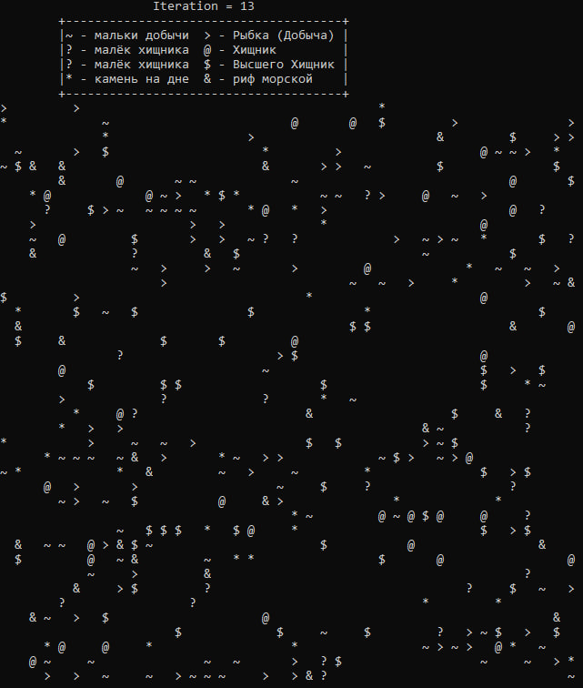

# The Ocean Game
This is a game based on a similar principle to cellular automata, only implemented through an ecosystem of marine life. We have 5 types of marine life.

## The name of marine life  
|        Good           |          Evil           |
|-----------------------|-------------------------|
| ~ - Small fish (prey) | ? - Small predator      |
| > - Fish (Prey)       | @ - Predator            |
| & - Marine reef       | ? - Small apex predator |
| * - Stone             | $ - Apex predator       |

## Marine life
1. Stone 
An ordinary stone at the bottom of the sea. Every std::rand() % 3 + 5 iterations it turns into a marine reef.
2. Marine reef
Provides shelter from predators. If there is coral on the adjacent cage from Prey, then Prey cannot be eaten. Every std::rand() % 3 + 5 iterations it turns into a stone.
3. Prey
A small fish that lives for 20 iterations. After 10 iterations of life, it grows out of a fry and becomes able to leave offspring with another similar fish. Forced to constantly avoid all predators, the coral reef is the salvation for prey. It moves with the flow with other fish of its type for 1 cell. If he meets a predator, he swims away in the other direction.
4. Predator
A predator that lives for 25 iterations. After 12 iterations of life, it grows out of a fry and becomes able to leave offspring with another similar fish and eat all prey that gets in the way. It moves randomly by 1 cell if it is slightly hungry and by 2 cells if it is very hungry. It breeds with another predator if both are full and there is no superior predator nearby.
5. Apex predator
A killing machine, the highest link in the food chain, living for 25 iterations. After 10 iterations, he matures and starts hunting for everything. If the top predator is full, it moves randomly by 1 cell in search of prey. If you are hungry (you have not eaten for 4 iterations), then 2 cells move and eat all the fish, even the predator. It is capable of procreating with another top predator.

## Example

## User interaction
At the beginning of the program, the user is asked to set the dimensions for the ocean, then set the number of iterations of ocean life.

