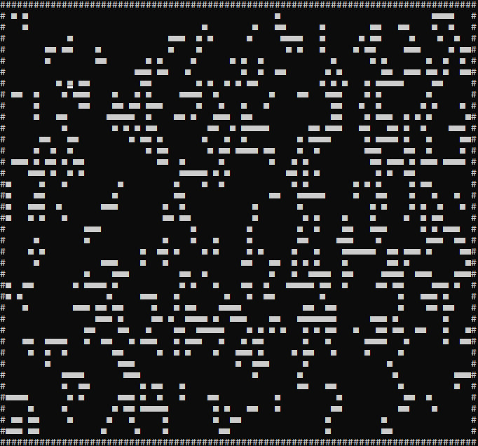

# Cellular automaton
A cellular automaton (pl. cellular automata, abbrev. CA) is a discrete model of computation studied in automata theory. Cellular automata have found application in various areas, including physics, theoretical biology and microstructure modeling.

## History and concept
In the 1970s a two-state, two-dimensional cellular automaton named Game of Life became widely known, particularly among the early computing community. Invented by John Conway and popularized by Martin Gardner in a Scientific American article, its rules are as follows:

    1. Any live cell with fewer than two live neighbours dies, as if caused by underpopulation.
    2. Any live cell with two or three live neighbours lives on to the next generation.
    3. Any live cell with more than three live neighbours dies, as if by overpopulation.
    4. Any dead cell with exactly three live neighbours becomes a live cell, as if by reproduction.

Despite its simplicity, the system achieves an impressive diversity of behavior, fluctuating between apparent randomness and order. One of the most apparent features of the Game of Life is the frequent occurrence of gliders, arrangements of cells that essentially move themselves across the grid. It is possible to arrange the automaton so that the gliders interact to perform computations, and after much effort it has been shown that the Game of Life can emulate a universal Turing machine. It was viewed as a largely recreational topic, and little follow-up work was done outside of investigating the particularities of the Game of Life and a few related rules in the early 1970s.

If you are interested in this topic, you can read about cellular automata on [Wikipedia](https://en.wikipedia.org/wiki/Cellular_automaton).